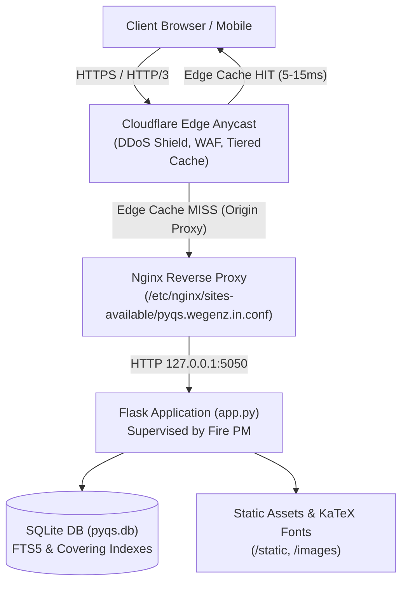

# Pyqbox Developer & AI Agent Guide (`AGENT.md`)

Welcome to the **Pyqbox** repository. This document serves as the primary architectural and operational guide for AI agents and developers working on this codebase.

---

## 1. Project Overview

**Pyqbox** is an ultra-fast, local-first practice portal for Indian competitive exams (**JEE Main**, **JEE Advanced**, and **NEET UG**). It serves **22,359 verified previous year questions (PYQs)** complete with full step-by-step worked solutions, local diagrams, server-side pre-rendered KaTeX math, multi-year research analytics, and official paper/shift simulations.

### Key Metrics
* **Total Questions**: 22,359 (JEE Main: 14,436 | JEE Advanced: 1,992 | NEET UG: 5,931)
* **Official Papers & Shifts**: 270 full papers (JEE Main: 193 shifts | JEE Advanced: 41 papers | NEET: 36 papers)
* **Exam Years**: 2002 – 2026
* **Database**: SQLite 3 (`pyqbox_data/pyqs.db` ~958 MB) with FTS5 full-text search and composite covering indexes.
* **Production Domain**: `https://pyqs.wegenz.in/`

---

## 2. System Architecture



### Components
1. **Application Server (`app.py`)**:
   * Lightweight Python Flask backend handling dynamic routing, search, multi-year aggregations, and REST API endpoints.
   * Managed as a persistent Linux system service via **Fire PM** (`fire-pyqs-app.service`).
2. **Database (`pyqbox_data/pyqs.db`)**:
   * High-performance single-file SQLite database.
   * Full-text search via SQLite FTS5 table `questions_fts`.
   * Composite covering indexes (`idx_questions_analytics_covering`, `idx_questions_analytics_type`) delivering sub-10ms queries.
3. **Frontend & Typography**:
   * Pure server-rendered Jinja2 HTML templates (`templates/`).
   * **100% Self-Hosted Math & Analytics**: Zero external CDN calls. KaTeX fonts and Chart.js 4.4.4 are bundled locally in `/static/`.
   * Server-rendered KaTeX HTML stored directly in `options_json` to avoid client-side parsing flicker.
4. **Edge Caching & Security**:
   * Cloudflare Edge Proxy with Tiered Caching enabled on `wegenz.in`.
   * Page Rule `*pyqs.wegenz.in/*` set to `cache_everything`.
   * Tiered `Cache-Control` header policy: 1-year immutable static assets, 30-day diagrams, 1-day edge cache for questions & analytics.

---

## 3. Directory Layout

```
/root/pyqs/
├── app.py                      # Core Flask application & REST API routes
├── build_db.py                 # SQLite database builder from JSONL files
├── refresh_clean_options.py    # Scrapes clean pre-rendered KaTeX options from source papers
├── scraper.py                  # Pyqbox source scraper
├── requirements.txt            # Python dependencies (Flask, requests, beautifulsoup4)
├── pyqbox_data/
│   ├── pyqs.db                 # Master SQLite database (958 MB)
│   ├── jee_mains.jsonl         # JEE Main raw dataset (14,436 records)
│   ├── jee_adv.jsonl           # JEE Advanced raw dataset (1,992 records)
│   ├── neet.jsonl              # NEET UG raw dataset (5,931 records)
│   └── images/                 # Question & solution diagram assets
├── static/
│   ├── app.js                  # Interactive client logic (instant answer check)
│   ├── chart.min.js            # Self-hosted Chart.js 4.4.4
│   ├── custom.css              # Theme, typography & KaTeX math alignment styles
│   └── katex/                  # Self-hosted KaTeX distribution (CSS, JS, WOFF2 fonts)
└── templates/
    ├── base.html               # Master layout with sidebar navigation
    ├── index.html              # Homepage with exam cards & quick action pills
    ├── exam.html               # Exam landing with Mode tabs (Chapter, Paper, Analysis)
    ├── chapter_index.html      # Chapter question catalog & multi-filter controls
    ├── question_view.html      # Single question practice view with worked solutions
    ├── papers.html             # Shift & paper catalog grouped by year
    ├── paper_index.html        # Single shift/paper question index
    └── analysis.html           # Exam Analytics & Research Lab with multi-year Chart.js graphs
```

---

## 4. Key Endpoints

| URL Path | Type | Purpose |
| :--- | :--- | :--- |
| `/` | HTML | Portal homepage with exam cards |
| `/<exam>/` | HTML | Chapter-wise question navigator (`main`, `advanced`, `neet`) |
| `/<exam>/papers/` | HTML | Shift & Paper index grouped by year |
| `/<exam>/paper/<slug>/` | HTML | Full paper question catalog |
| `/<exam>/paper/<slug>/<int:q_index>/` | HTML | Paper-mode individual question practice |
| `/<exam>/<subject>/<chapter>/` | HTML | Chapter-mode question index (supports multi-year filter) |
| `/<exam>/<subject>/<chapter>/<int:q_index>/` | HTML | Chapter-mode individual question practice |
| `/<exam>/analysis/` | HTML | Multi-Year Research & Weightage Lab |
| `/api/v1/analytics` | JSON | REST API for chapter weightage, trends & distribution |
| `/api/v1/exams` | JSON | Exam metadata and overall statistics |
| `/api/v1/questions/<id>` | JSON | Raw question data by UUID |
| `/api/v1/check-answer` | POST | Dynamic answer verification endpoint |
| `/api/v1/search` | JSON | FTS5 full-text keyword search API |

---

## 5. Developer & Agent Workflow

### Managing the Process via Fire PM
The application runs as a managed Linux service named `pyqs-app`:
```bash
# Check service status, memory, CPU, and uptime
fire info pyqs-app

# Inspect real-time logs
fire logs pyqs-app

# Restart after code changes
fire restart pyqs-app

# Stop / Start service
fire stop pyqs-app
fire start app.py --name pyqs-app --interpreter python3
```

### Local Testing
```bash
# Verify local HTTP status and headers
curl -s -I http://127.0.0.1:5050/

# Verify Nginx local reverse proxy
curl -s -I -H "Host: pyqs.wegenz.in" http://127.0.0.1/

# Verify Cloudflare live production endpoint
curl -s -I https://pyqs.wegenz.in/
```

### Rebuilding or Updating the Database
```bash
# Rebuild pyqs.db from JSONL files
python3 build_db.py

# Refresh and sync clean pre-rendered options across all 270 papers
python3 refresh_clean_options.py
```

---

## 6. Critical Gotchas & Architectural Context

1. **SQLite Year Column is `TEXT`**:
   * The `year` column in the `questions` table is stored as SQLite `TEXT` (e.g. `'2026'`).
   * When querying with `year IN (?, ?)`, always pass string arguments `[str(y) for y in selected_years]` to ensure exact type-affinity index matches.
2. **HEAD vs GET in `add_cache_headers`**:
   * Always check `request.method not in ('GET', 'HEAD')` rather than `request.method != 'GET'`. Standard health-check probes (`curl -I`) send `HEAD` requests.
3. **Server-Side Math Rendering**:
   * Options are stored as `{"option": "A", "text": "...", "html": "<p><span class=\"katex\">...</span></p>"}`.
   * The template renders `opt.html|safe` first. Never strip `opt.html` tags, as client-side LaTeX re-parsing causes visual layout shift and font mismatch.
4. **Absolute IP & Host Confidentiality**:
   * Never write, expose, or commit server IP addresses into documentation, commit messages, or issues. Always use `<your-vps-ip>` or documentation IP `192.0.2.1`.
5. **Zero External CDN Calls**:
   * Chart.js, KaTeX JS/CSS, and all fonts must remain strictly local within `/static/`. Do not introduce unpkg, cdnjs, or Google Fonts dependencies.
