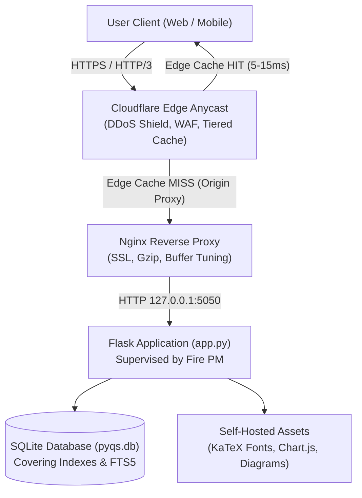

<div align="center">

# 📦 Pyqbox

**High-Performance Local-First Practice Portal for JEE Main, JEE Advanced & NEET UG**

[](https://pyqs.wegenz.in/)
[](https://www.python.org/)
[](https://flask.palletsprojects.com/)
[](https://sqlite.org/)
[](LICENSE)

<p align="center">
  Instant, distraction-free access to <strong>22,359 official competitive exam questions</strong> complete with worked solutions, local diagrams, multi-year weightage analytics, and global Cloudflare edge caching.
</p>

[Explore Practice Portal](https://pyqs.wegenz.in/) • [Research & Analytics Lab](https://pyqs.wegenz.in/main/analysis/) • [API Reference](#-rest-api-documentation) • [Developer Guide](AGENT.md)

</div>

---

## ⚡ Key Highlights

* **22,359 Real Exam Questions**: Fully cataloged and verified across JEE Main (14,436), JEE Advanced (1,992), and NEET UG (5,931).
* **270 Official Shifts & Papers**: Full official question papers grouped by year (2002–2026).
* **Research & Weightage Analytics Lab**: Analyze high-yield chapters, subject distribution, and exam trends with interactive multi-year selections and Chart.js graphs.
* **100% Pre-Rendered KaTeX Math**: Math options are pre-rendered server-side into crisp HTML, eliminating client-side font flicker and unrendered LaTeX raw text.
* **Global Cloudflare Edge Caching**: Backed by Cloudflare Smart Tiered Caching (`CF-Cache-Status: HIT` in 5–15ms) across 300+ edge data centers worldwide.
* **Zero External CDN Dependencies**: KaTeX fonts, Chart.js 4.4.4, and styling are 100% self-hosted locally for privacy and resilience.
* **Sub-10ms Query Engine**: Composite SQLite covering indexes and FTS5 full-text search engine.

---

## 🏛️ System Architecture



> [!NOTE]
> All origin traffic is routed through Cloudflare's private edge network with the origin IP address strictly hidden behind Cloudflare Anycast proxies.

---

## 📊 Exam Coverage & Statistics

<table>
<tr>
<th width="33%">📘 JEE Main</th>
<th width="33%">🎯 JEE Advanced</th>
<th width="33%">🩺 NEET UG</th>
</tr>
<tr>
<td>

* **14,436 Questions**
* **193 Shifts & Papers**
* **89 Chapters**
* Years: **2010 – 2026**
* Physics, Chemistry, Maths

[Practice JEE Main &rarr;](https://pyqs.wegenz.in/main/)

</td>
<td>

* **1,992 Questions**
* **41 Full Papers**
* **93 Chapters**
* Years: **2006 – 2026**
* Paper 1 & Paper 2

[Practice Advanced &rarr;](https://pyqs.wegenz.in/advanced/)

</td>
<td>

* **5,931 Questions**
* **36 Official Papers**
* **88 Chapters**
* Years: **2002 – 2026**
* Physics, Chemistry, Bio

[Practice NEET UG &rarr;](https://pyqs.wegenz.in/neet/)

</td>
</tr>
</table>

---

## 🔬 Exam Analytics & Research Lab

The platform includes a dedicated high-yield research suite accessible at [`/main/analysis/`](https://pyqs.wegenz.in/main/analysis/):

```
┌────────────────────────────────────────────────────────────────────────┐
│  ⚡ QUICK PRESETS:  [All Years]  [Last 3 Years]  [Last 5 Years]  [2026] │
│  📅 EXAM YEARS:    [✔ 2026] [✔ 2025] [✔ 2024] ... (Combined Query)      │
└────────────────────────────────────────────────────────────────────────┘
```

* **Multi-Year Analysis**: Select multiple years simultaneously to inspect combined question weightage.
* **Top 15 Chapter Bar Chart**: Real-time visual ranking of highest yield chapters.
* **Subject Share Doughnut**: Accurate percentage breakdown of subjects for the selected timeframe.
* **Historical Volume Trend**: Bar chart highlighting the selected years against the complete historical record.
* **Direct Practice Integration**: Click **Practise &rarr;** on any ranked chapter to immediately solve questions filtered to those exact selected years.

> [!TIP]
> In the historical trend graph, selected years are highlighted in **Teal (`#0f766e`)**, while unselected years are displayed in muted gray for instant visual comparison.

---

## 🚀 Local Development Setup

### Prerequisites
* Python 3.10+
* Linux / macOS / Windows WSL

### Installation

```bash
# 1. Clone repository
git clone https://github.com/wegenz/pyqs.git
cd pyqs

# 2. Install dependencies
pip install -r requirements.txt

# 3. Start local development server
python3 app.py --port 5050
```

Visit `http://localhost:5050` in your browser.

---

## 🌐 Production Operations & Process Management

In production, the application is managed by **Fire PM** and reverse-proxied by **Nginx**:

```bash
# Inspect process status, memory, and CPU usage
fire info pyqs-app

# Follow real-time application logs
fire logs pyqs-app

# Restart application service
fire restart pyqs-app

# Verify local Nginx reverse proxy
curl -s -I -H "Host: pyqs.wegenz.in" http://127.0.0.1/

# Verify Cloudflare edge cache HIT
curl -s -I https://pyqs.wegenz.in/main/paper/jee-main-2026-02-april-shift-1/1/
```

---

## 🔌 REST API Documentation

Pyqbox exposes a read-only public REST API for research and educational tools.

### 1. Multi-Year Analytics API
```bash
curl -s "https://pyqs.wegenz.in/api/v1/analytics?exam=main&years=2024,2025,2026" | jq .
```
```json
{
  "exam": "main",
  "total_questions": 4631,
  "years": [2026, 2025, 2024],
  "top_chapter": {
    "chapter": "general-organic-chemistry",
    "chapter_name": "General Organic Chemistry",
    "count": 166,
    "percentage": 3.6
  },
  "chapters": [...]
}
```

### 2. Full-Text Search API
```bash
curl -s "https://pyqs.wegenz.in/api/v1/search?q=photoelectric+effect" | jq .
```

### 3. Exam Metadata & Papers
```bash
curl -s "https://pyqs.wegenz.in/api/v1/exams" | jq .
curl -s "https://pyqs.wegenz.in/api/v1/papers?exam=advanced" | jq .
```

---

## 📁 Repository Structure

```
/root/pyqs/
├── app.py                      # Core Flask web server & REST API
├── build_db.py                 # SQLite database compiler
├── refresh_clean_options.py    # Batch scraper for pre-rendered KaTeX options
├── requirements.txt            # Python dependencies
├── AGENT.md                    # AI Agent architectural reference guide
├── AGENT_HISTORY.md            # Persistent work memory & session logs
├── CHANGELOG.md                # Release version changelog
├── CONTRIBUTING.md             # Contribution guidelines
├── LICENSE                     # MIT License
├── pyqbox_data/                # Database and raw datasets (gitignored)
├── static/                     # Self-hosted Chart.js, KaTeX fonts & CSS
└── templates/                  # Jinja2 HTML templates
```

---

## 📄 License

This project is open-source under the [MIT License](LICENSE).
